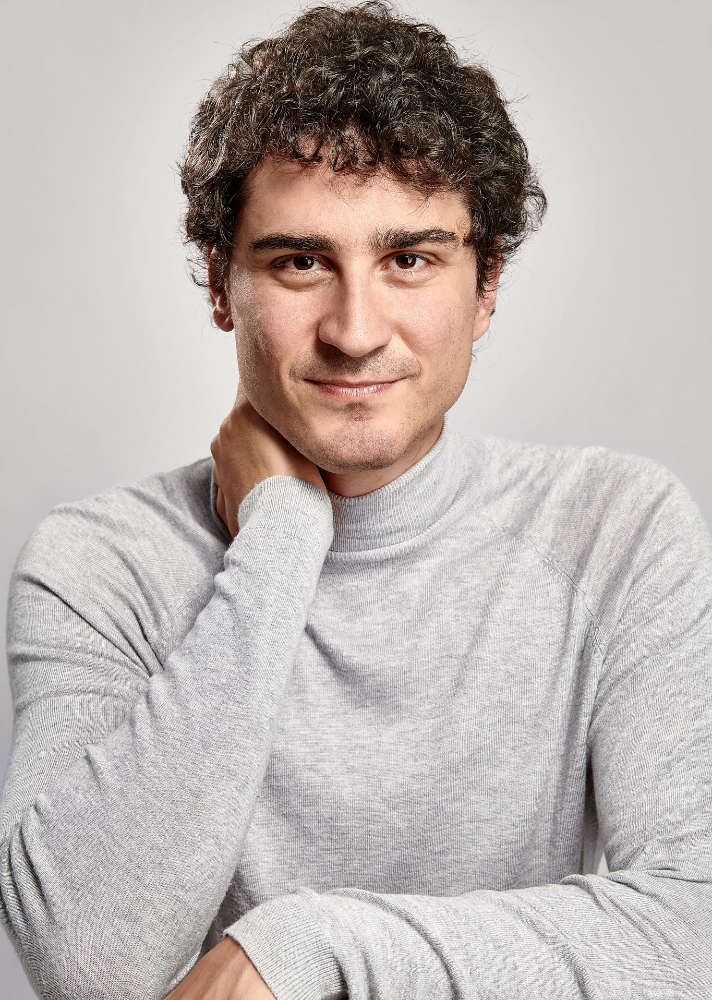

<!-- Redirected from A Website Builder -->

<table style="border-collapse: collapse; border: none;">
  <tr style="border: none;">
    <td style="border: none; vertical-align: middle; padding-right: 10px;">
      
    </td>
    <td style="border: none; vertical-align: middle;">
      High-energy physicist working across Physics (Quantum Fields and Strings), Mathematics (Algebraic Geometry and Category Theory) and Machine Learning.
    </td>
  </tr>
</table>

 

Short Physics/Maths Academic Bio 

  

 
  
I studied at the University of Zurich/ETHZ (Swiss Federal Institute of Technology), and completed a PhD/DPhil at the Mathematical Institute of the University of Oxford. My MSc advisor was Niklas Beisert, my DPhil supervisor Lionel Mason. I have been affiliated with the Perimeter Institute, Durham University, the University of Edinburgh, DESY Hamburg. I am currently visiting the University of Cambridge.

  

 

My Physics/Maths papers can be found on [InSpire](https://inspirehep.net/authors/1712079), and when it comes to ML conferences, on [OpenReview](https://openreview.net/profile?id=~Andrea_E._V._Ferrari1). Several of my talks can be found online. See below for a quick summary of my interests, and links to sample talks and slide decks.

Physics and Maths Research

 
  
Broadly speaking, I have been pioneering the following research directions:

<ul style="font-size:14px;">
<li> 
    The description of observables of 3d SUSY gauge theories in terms of the geometry of vortex and quasi-map moduli spaces. 
    <a href="https://pirsa.org/19030107" target="_blank">Sample talk at PI</a> and 
    <a href="./talks/Geom_Indices.pdf" target="_blank">sample slide deck</a>.
</li>
<li>
    The understanding of 2d chiral CFTs (VOAs) that arise at the boundary of tolopogically twisted 3d QFTs in terms of the vacuum geometry of the 3d theory.
    <a href="https://scgp.stonybrook.edu/video_portal/video.php?id=6991" target="_blank">Sample talk at the Simons Center</a> and 
    <a href="./talks/Hyper_VOAs.pdf" target="_blank">sample slide deck</a>.</li>
<li> 
    The understanding of generalised symmetries in QFT in terms of higher representation theory, opening up the study of their representations.
    <a href="https://www.youtube.com/watch?v=vwkouB69R-M" target="_blank">Sample talk at Oxford</a> and 
    <a href="./talks/GenSym_HigherGauge.pdf" target="_blank">sample slide deck</a>. 
</li>
<li> 
  The understanding of the relation between moduli spaces of Berry connections of QFTs/periodic monopoles and generalised cohomology.
  <a href="https://www.youtube.com/watch?v=vwkouB69R-M" target="_blank">Sample talk at ICTP</a> and 
  <a href="./talks/Berry_GenCoh.pdf" target="_blank">sample slide deck</a>. 
</li>
</ul>

 
I am currently working on the following:

<ul style="font-size:14px;">
<li> Exploit chiralisation techniques to describe geometrically spaces of conformal blocks of chiral CFTs. </li>
<li> Exploit chiralisation techniques to understand AdS/CFT holography at minimal string tension. </li>
<li> Understand more thoroughly the deep relationship between Berry phases and generalised cohomology. </li> 
<li> Exploit higher geometry to understand generalised symmetries and their representations.  </li>
</ul>

Physics and ML Research 

  

 

One of the most important tasks in Machine Learning applied to Physics is to fit parameters in a Hamiltonian such that observed data is reproduced. Given this, can one learn not only a Hamiltonian, but also features such as the structure of the space the system is defined on, and the observables that are producing certain correlation functions? 

This question is fundamental if one wants to automatically discover dualities. I am currently pioneering such approaches. See this <a href="https://icml.cc/virtual/2025/poster/44740" target="_blank">ICML25</a> paper for some first results.
  

 

Whenever not detrimental to my research (such as during the pandemic), I have been a promoter of interactions between academia and the industry. Here is a quick summary of what I've done so far.

Mathematics and Industry

 
  
Over the years, I have used maths and ML competences to do work on and advise on risk management, megaproject management, construction more generally. Contact me if you'd like to hear more.
  

 

My first intellectual interests were in Philosophy, and I also have a strong academic background in the discipline. It remains one of my hobbies.

Philosophy Background and Interests

 

I have been passionate about Philosophy, both continental and analytic. I did some Philosophy in my undergrad and completed with distinction an MSt in Philosophy of Physics at the University of Oxford. I wrote essays on epistemology, philosophy of science, and philosophy of physics. I enjoy thinking about how the foundations of mathematics and geometry impact the construction of physical theories. If you are at all curious about this, feel free to contact me.

 

I am passionate about music, hiking (especially around the <a href="https://en.wikipedia.org/wiki/Lodrino,_Ticino" target="_blank">tiny Swiss alpine town</a> my family has been inhabiting <a href="https://www.patriziatolodrino.ch/index.php?node=301&lng=1&rif=5c75e69550" target="_blank">for more than six centuries</a>, as well as around high-altitude volcanos), writing, and a few other things.

Others 

 

I am trying to build a generative model that composes fugues. If you are interested in contributing, contact me.

 

Contact me via [email](mailto:andrea.e.v.ferrari@gmail.com) and/or on [LinkedIn](https://www.linkedin.com/in/andreaevferrari/) / [GitHub](https://github.com/andreaevferrari) 
